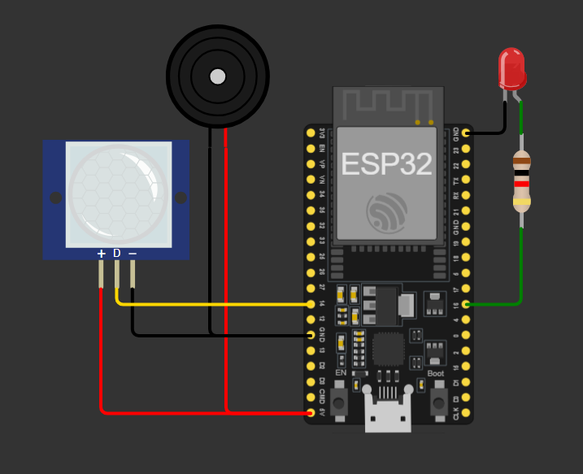
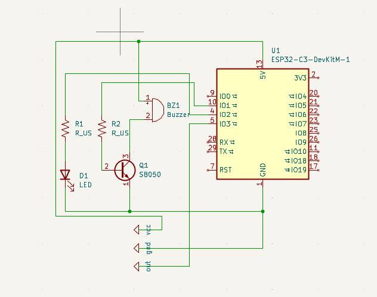

# Sensor simples de movimento

## Descrição
A ideia do projeto é desenvolver um sistema de detecção de movimento que ao acionar emite um som acende um led.
O projeto tem o intuito simples de praticar minha documentação de projetos eletrônicos e elaborar uma maneira fácil e otimizada de demonstrar meus projetos aqui no github.
Testar qual melhor formato e o que faz sentido ou não incluir e como se deve incluir !

## Funcionalidades
- Detecção de movimento utilizando sensor PIR
- Acionamento automático do buzzer
- Acende um led ao detectar

## Hardware
| Componente | Quantidade |
|---|---:|
| ESP32-WROVER | 1 |
| Sensor PIR HC-SR501 | 1 |
| Buzzer ativo | 1 |
| Transistor NPN S8050 | 1 |
| Resistor 1kΩ | 2 |
| Protoboard | 1 |
| Jumpers | vários |

## Esquemático

  
  

## Resultados

  

